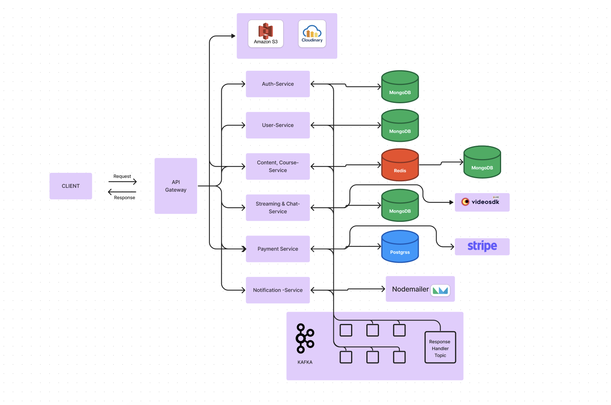

# Eduverse E-Learning Platform

Eduverse is an innovative educational networking platform where learners and instructors connect to share knowledge. Our platform empowers instructors to easily apply, create courses, conduct exams, one-to-one chat with video call, thereby enriching the learning experience for students worldwide.

## Table of Contents
- [Features](#features)
- [Technology Stack](#technology-stack)
- [Getting Started](#getting-started)
  - [Prerequisites](#prerequisites)
  - [Installation](#installation)
- [Usage](#usage)
- [System Architecture](#system-architecture)
- [Contributing](#contributing)
- [License](#license)

## Features

- **Comprehensive Course Management**: Offer both free and paid courses with seamless payments.
- **Real-time Interaction**: Implement text-chatting, audio/video communication, and file sharing using WebSockets for engaging learning environments.
- **Microservices Architecture**: Ensure scalability and maintainability using clean architecture principles and Apache Kafka for efficient interservice communication.
- **Cloud-Native Deployment**: Utilize containerization with Docker and deploy on Azure Kubernetes Service for optimal performance and scalability.
- **Instructor Onboarding**: Streamlined process for instructors to apply and get admin approval to join the platform.

## Technology Stack

- **Frontend**: React.js, Redux, WebRTC
- **Backend**: Node.js, Express.js
- **Database**: MongoDB
- **Messaging**: Apache Kafka
- **Containerization**: Docker
- **Orchestration**: Kubernetes (Azure Kubernetes Service)


## Getting Started

### Prerequisites

- Node.js (v14 or later)
- npm (v6 or later)
- MongoDB (v4 or later)
- Docker
- Kubernetes CLI (kubectl)

### Installation

1. Clone the repository:

   ```bash
   git clone https://github.com/nahyan0077/eduverse-frontend.git
   ```

2. Navigate to the project frontend directory:

   ```bash
   cd eduverse-backend
   ```

   ```bash
   npm install
   ```

   ```bash
   npm run dev
   ```


## Usage

1. Access the application at `http://localhost:3001` (or the port specified in your environment).
2. Register as a student or apply as an instructor.
3. Explore courses, participate in live sessions, or create content (for approved instructors).

## System Architecture



Our system utilizes a microservices architecture to ensure scalability and maintainability:

- **API Gateway**: Routes requests to appropriate microservices
- **Auth Service**: Handles user authentication and authorization
- **Course Service**: Manages course creation and delivery
- **Chat Service**: Manages real-time communication features
- **notification Service**: Manages all the notifications 
- **Payment Service**: Processes payments for paid courses

## Contributing

We welcome contributions to Eduverse! Please see our [CONTRIBUTING.md](CONTRIBUTING.md) for details on our code of conduct and the process for submitting pull requests.

## License

This project is licensed under the MIT License - see the [LICENSE.md](LICENSE.md) file for details.


### End of Page